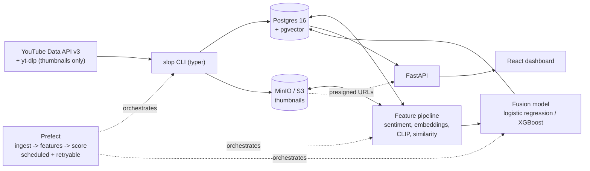

# Slop-or-Not

A YouTube content-quality classifier: given a channel, ingest its videos, score each one
"slop" or "not" using metadata, comment sentiment, thumbnail embeddings, and cross-video
similarity, then browse and label results through a web dashboard. Full design and
phased plan: [ROADMAP.md](ROADMAP.md). Where implementation diverged from the plan and
why: [DEVIATIONS.md](DEVIATIONS.md). Stage-by-stage build notes for every phase, plus a
running list of manual/external setup steps: [docs/writeups/](docs/writeups/).

## What "slop" means here

Slop is content optimized to capture attention or watch time with as little effort as
possible, at the expense of being honest, original, or informative about what it
actually delivers - a mismatch between what a video promises (title, thumbnail, upload
pattern) and what it actually gives a viewer, not a proxy for low budget or low polish.
The classifier looks for four signal categories: mass-produced/templated content,
misleading thumbnail-title mismatches, low information density, and (as an explicit
counterweight) what's NOT slop - a consistent format, an earned narrative device, or a
low-budget video that's still honest about what it is. The full rubric, including
worked examples and edge-case tie-breakers, lives in [docs/rubric.md](docs/rubric.md) -
it's the operational definition the whole pipeline is trying to predict, and it was
revised once after the first ~50 real labels surfaced cases the first draft didn't
anticipate.

## Architecture



Every table uses YouTube's own ids as primary keys; there are no ORM `relationship()`s
anywhere in the codebase, only explicit joins. Object storage (thumbnails) and the
relational/vector store (everything else) are the same API locally (MinIO) and in
production (real S3) - only the endpoint/credentials change, per Phase 0's "12-factor
from day one" design goal.

| Layer | Built in | What it does |
|---|---|---|
| Ingestion (`src/sloppy/ingest/`) | Phase 1 | YouTube Data API for metadata/comments, yt-dlp for thumbnails only (never full video/audio) |
| Labeling (`src/sloppy/label/`) | Phase 2 | Channel-balanced pool sampling, keyboard-driven CLI labeling, train/val/test splitting |
| Feature engineering (`src/sloppy/features/`) | Phases 3-4 | Metadata features, comment sentiment/topic clustering, title-intent scoring, CLIP thumbnail embeddings, cross-video similarity, feature interactions |
| Model (`src/sloppy/models/`) | Phases 3-4 | Logistic regression + XGBoost, ablation across metadata/+text/+vision feature groups, SHAP interaction analysis |
| API (`src/sloppy/api/`) | Phase 5 | FastAPI - paginated video list/detail, channel stats, ingest trigger, labeling endpoint |
| Dashboard (`web/`) | Phase 6 | React + TypeScript + Tailwind + TanStack Query - video grid, video detail, channel view, web-based labeling |
| Orchestration (`src/sloppy/flows/`) | Phase 7 | Prefect - retryable ingest -> features -> score flow, daily-scheduled per tracked channel |
| Deployment | Phase 8 | Docker Compose locally; reference Terraform (`infra/terraform/`) for an AWS migration - see below |

## Results

**A first real-data result exists, and it is modest.** As of 2026-10-06 the pipeline has run
end to end on real YouTube data: 60 channels, 626 videos, 646 channel-level labels (about
32% slop), then splits, NLP and vision features, and both baseline models. The honest
estimate, from stratified k-fold cross-validation grouped by channel (so every test channel
is one the model never trained on): PR-AUC 0.59 +/- 0.13 for XGBoost and 0.60 +/- 0.09 for
logistic regression, against a majority-class baseline of 0.31 (F1 about 0.5 for both models,
0 for the baseline). That is real signal on unseen channels, but noisy and far from
reliable, with only about 58 labeled channels behind it. An earlier by-video split scored
XGBoost at PR-AUC 0.99; that figure was inflated by channel leakage (labels are per channel,
so the model could just recognize channels) and should be ignored. Details:
[docs/writeups/phase-3/cross-validation.md](docs/writeups/phase-3/cross-validation.md) and
[docs/writeups/phase-3/real-data-first-run.md](docs/writeups/phase-3/real-data-first-run.md).
Still to come:

- An ablation table (metadata-only vs. +text vs. +full feature set, via
  `slop model ablation`) will go here, following the format documented in
  [docs/writeups/phase-4/stage-13-ablation-training.md](docs/writeups/phase-4/stage-13-ablation-training.md).
- A SHAP interaction report (`scripts/shap_interaction_report.py`) will go here,
  following [docs/writeups/phase-4/stage-14-shap-interaction-report.md](docs/writeups/phase-4/stage-14-shap-interaction-report.md).
- A short demo GIF of the dashboard (ingest a channel, watch scores appear, browse
  similar videos) will go here, once a public deployment exists to record it against.

## Quickstart (local)

```powershell
# 1. Copy env config (defaults work for local dev)
copy .env.example .env

# 2. Start Postgres (+pgvector), MinIO, and the Prefect server
docker compose up -d

# 3. Install Python deps (installs Python 3.12 automatically if needed)
uv sync

# 4. Install frontend deps
cd web && npm install && cd ..

# 5. Verify everything is wired up
uv run slop smoke

# 6. (once) install git hooks
uv run pre-commit install
```

Run the API and dashboard for local development:

```powershell
uv run uvicorn sloppy.api.app:app --reload --port 8000   # API at :8000, docs at :8000/docs
cd web && npm run dev                                      # dashboard at :5173, proxies /api to :8000
```

MinIO console: http://localhost:9001. Prefect UI: http://localhost:4200. Credentials for
both are in `.env`.

## Development

```powershell
uv run pytest         # backend tests
uv run ruff check .   # backend lint
uv run ruff format .  # backend format
uv run slop --help    # CLI

cd web
npx vitest run        # frontend tests
npm run lint           # frontend lint
npm run build           # production bundle
```

## Deployment

**Local (docker-compose)**: `docker compose up -d --build api web` builds and serves the
full stack (API + dashboard behind nginx, reverse-proxying `/api/*` internally) on
`http://localhost:8080`. See [docs/writeups/phase-8](docs/writeups/phase-8/).

**AWS**: `infra/terraform/` has reference Terraform for the roadmap's Phase 8 migration
(S3 replacing MinIO, RDS replacing local Postgres, a single EC2 instance running the same
docker-compose stack). **This has never been applied against a real account** - no AWS
credentials exist in this project's development environment. It's real, validated
(`terraform validate`), ready-to-provision reference architecture, not a live deployment.
See [infra/terraform/README.md](infra/terraform/README.md) for the full mapping from
Terraform outputs to `.env` variables, and
[docs/writeups/phase-8](docs/writeups/phase-8/) for the stage-by-stage build notes.
